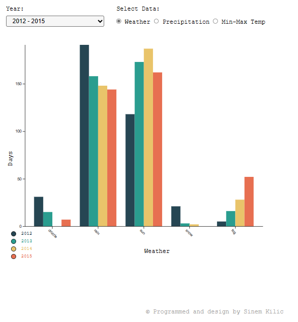

# Visualisation Interactive de Données Météorologiques 

## Objectif du code

Cette application vise a fournir aux utilisateurs un moyen convivial et visuellement attrayant d'explorer et de comprendre les prévisions météorologiques historiques.L'objectif clé est de permettre aux utilisateurs de visualiser les variations et les schémas des conditions météorologiques, notamment les précipitations, les températures maximales et minimales, les types de temps tels que la pluie, le soleil, la neige, et bien plus encore.
- L'image suivante illustre la visualisation interactive des données météorologiques générée à l'aide de la bibliothèque D3.js

Les données originales peuvent être consultées [ici](https://www.kaggle.com/datasets/ananthr1/weather-prediction).

## Fonctionnalités Clés :

* Filtres Personnalisables : Les utilisateurs peuvent sélectionner différents filtres, notamment l'année et le type de données à afficher, pour personnaliser leur expérience de visualisation.

* Graphiques Interactifs : Les codes utilisent la puissante bibliothèque D3.js pour générer des graphiques à barres et de dispersion interactifs en fonction des filtres choisis. Ces graphiques offrent une représentation visuelle détaillée des données météorologiques.

* Interface Adaptative : La page web est conçue pour être entièrement réactive en suivant une approche "mobile first", assurant ainsi une expérience utilisateur cohérente et agréable sur différentes tailles d'écran.

* Mises à Jour en Temps Réel : Les graphiques sont mis à jour instantanément en fonction des filtres sélectionnés par les utilisateurs, permettant une exploration en temps réel des données.

## Utilisation

Le projet prend en charge deux types principaux de visualisations : les conditions météorologiques et les précipitations. Vous pouvez choisir de voir les tendances pour des années spécifiques (2012-2015) ou vous concentrer sur des trimestres individuels au sein d'une année. Les données de température sont présentées à l'aide de graphiques à dispersion. 

## Instructions d'Utilisation
* Clonez ce dépôt sur votre ordinateur ou téléchargez le fichier ZIP.
* Ouvrez le projet dans un éditeur de code, tel que Visual Studio Code.
* Ouvrez le fichier index.html dans votre navigateur pour accéder aux visualisations.

### Modules et Dépendances
Ce projet utilise la bibliothèque D3.js à partir de CDN et il n'y a aucune dépendance requise.
- D3.js - Bibliothèque JavaScript pour la manipulation d'éléments HTML et la création de graphiques interactifs.

----------------------

Ce projet a été développé par Sinem KILIC, dans le cadre du cours <Visualisation de données> dispensé par Isaac Pante (SLI, Lettres, UNIL).

La source des images utilisées dans l'interface est pexels.com.